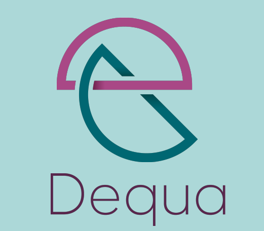

<h1 align="center">
    Dequa
    <br>
    <a href="https://www.linkedin.com/in/joão-pedro-buzatti-mendes-b032301ba">
      
    </a>
</h1>
<p align="center"> 
<b>
API desenvolvida durante a segunda fase do <a href="https://ioasys.com.br/">Ioasys</a> Camp - Trilha Backend
</b>
</p>
<p align="center"> 
Você já reparou em quantas pessoas com deficiência convivem ou já conviveram com você?
</p>
<p align="center">
 <a href="#objective">Objetivo</a> •
 <a href="#technologies">Tecnologias</a> • 
 <a href="#usage">Utilizar</a> • 
 <a href="#documentação">Documentação</a> • 
 <a href="#author">Autor</a> • 
 <a href="#license">Licensa</a>
</p>

<h1 align="center">
    
</h1>


<h2 id="objective" > 🎯 Objetivo </h2>
O objetivo do Dequa é facilitar a presença de PCD's ( Pessoas com Deficiências ) no mercado de trabalho por meio de vagas personalizadas, acesso fácil á educação e sensação de inclusão e pertencimento.


<h2 id="technologies"> 🛠 Tecnologias </h2>

As seguintes tecnologias foram utilizadas neste projeto:

- [TypeScript](https://www.typescriptlang.org/)
- [NodeJS](https://nodejs.org/)
- [Postgres](https://www.postgresql.org/)
- [Typeorm](https://typeorm.io/#/)
- [AWS](https://aws.amazon.com/)
- [Docker](https://www.docker.com/)
- [Docker Compose](https://docs.docker.com/compose/)
- [Yarn](https://yarnpkg.com/)
- [ESlint](https://eslint.org/)
- [Prettier](https://prettier.io/)

<h2 id="usage"> :closed_book: Utilizar </h2>

```bash

## Clone o repositório do projeto 
$ git clone https://github.com/joaopedrobuzattim/dequa.git

## Entre na pasta criada 
$ cd ioasys2

## Instale as dependencias do projeto com o yarn ou com o npm
$ yarn
## Ou
$ npm install

## Rode o comando do Docker Compose para criar o container do Postgres
$ docker-compose up -d

## Crie um arquivo .env contendo as informações presentes em .env.example
$ touch .env

## Em um editor SQL de sua preferência, crie a database dequa
CREATE DATABASE dequa;

## Inicie a aplicação
$ yarn dev:server

## Rode as migrations
$ yarn typeorm migration:run 

## Aplicação rodando
```
## Documentação
 Esta API foi documentada com [Postman](https://www.postman.com/)
- Link: https://documenter.getpostman.com/view/13464744/TzXwEdjw


<h2 id="author">Autor</h2>

<a href="https://github.com/joaopedrobuzattim/">
 
 <br />
 <sub><b> João Pedro Buzatti Mendes </b></sub>
</a>

Entre em contato!

<a href="https://www.linkedin.com/in/joão-pedro-buzatti-mendes-b032301ba">
    
  </a>


## License
This project is MIT licensed.
